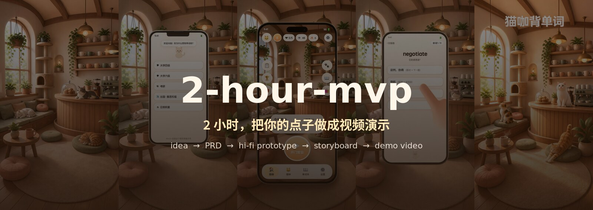
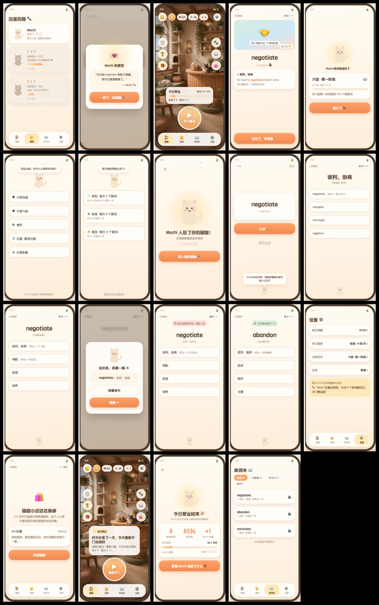

<div align="center">



# 2-hour-mvp

**2 小时，把你的点子做成视频演示。**

中间产物一样不少：PRD、可点击的高保真原型、分镜图，最后是演示视频。

[](https://skills.sh/losdwind/2-hour-mvp)
[](https://github.com/losdwind/2-hour-mvp/releases)
[](LICENSE)
[](https://agentskills.io)

```bash
npx skills add losdwind/2-hour-mvp
```

</div>

---

## 效果

拿「猫咖背单词」当例子，当时给的描述就一句：

> 在猫咖里背单词的 App，背词就是营业，猫是学习搭子，有断签回归安抚

<div align="center">

跑完流水线出来的片子（4 倍速预览，原片 60 秒 20 镜，覆盖全部 19 个页面）：


</div>

本页所有产物图都出自这一个案例，没有摆拍。

## 流程


入口技能 `product-video` 会看你手里有什么。只有点子就从头跑，已经有 PRD 或交互稿就从中间接着跑。每个阶段也是独立技能，单独用没问题。

| 技能 | 作用 | 交付物 |
| ------------------- | ---------------------- | -------------- |
| **product-video**   | 入口，判断从哪步开始、串流程、每阶段停下来等确认 | 全链路            |
| **idea-to-prd**     | 问答把点子收敛成 PRD           | PRD markdown   |
| **prd-to-hifi**     | 按 PRD 页面清单生成可点击交互稿     | 单文件 HTML       |
| **hifi-to-storyboard**  | 截图、规划分镜、seedream 生成分镜图 | 截图 + 分镜表 + 分镜图 |
| **storyboard-to-video** | seedance 逐镜生成、加速拼接     | 成片 mp4 + 质检图   |

## 每一步交付什么

### ① PRD，页面清单直接喂给下一步

```markdown
| 页面 id      | 页面名     | 业务分组 | 核心元素                               | 进入方式      |
| home        | 猫咖首页   | 主界面   | 场景背景、今日营业进度、开门营业大按钮   | 引导完成后默认 |
| quiz-wrong  | 答错安抚   | 每日学习 | 弹层"没关系再看一眼"、词义回看、继续按钮 | 答错任意题目   |
| streak-back | 断签回归态 | 主界面   | 安抚卡"昨天休息了一天"、重新开门按钮     | 断签后次日启动 |
```

页面清单要求列全。答错安抚、断签回归这类状态页容易被漏掉，但在演示视频里往往是最出效果的镜头。

### ② 可点击高保真，单文件 HTML



<sub>19 页：引导 5 页、主界面 3 页、每日学习 5 页、结算 2 页、周边 4 页。配色风格做的时候会问你。file:// 打开就能点，按真实业务流跳转</sub>

### ③ 分镜图，每页一张统一风格的标准帧


<sub>seedream 把每页截图放进同一个环境（这里是 soft 3D 猫咖），界面文字保持可读</sub>

### ④ 演示视频，3 秒一镜按业务逻辑走完


<sub>20 镜逐镜抽帧：空镜入场、引导五连、开门营业、学词答题、结算礼物、周边页面、断签回归、片尾标题</sub>

## 视频为什么不穿帮

三条写死在技能里的规则。

**剪辑点不跳。** 每页只做一张标准帧，上一镜的尾帧就是下一镜的首帧，剪辑点两侧是同一张图，不需要转场来遮。

**手机不乱动。** 运动 prompt 里写死了机身静止，全片只有屏幕内容在切换，只有开场入场和片尾退场两处允许机身移动。

**先花小钱再花大钱。** 生成前先报即梦积分预估，试跑两三镜确认节奏了再批量提交。下载自动校验，坏文件免费重下，中断了能从断点续跑。参考成本：上面这条 60 秒的片子约 1500 积分，12 秒短片约 500。

## 安装

**Claude Code / Codex / Cursor / OpenCode 等 70+ agent**

```bash
npx skills add losdwind/2-hour-mvp
```

**Claude Cowork** 用户下载 [Releases](https://github.com/losdwind/2-hour-mvp/releases) 里的 `2-hour-mvp.plugin`，拖进对话点安装。

<details>
<summary><b>依赖</b></summary>

- 即梦 dreamina CLI，第 ③④ 步用：`curl -s https://jimeng.jianying.com/cli | bash`，首次要 OAuth 登录，生成消耗即梦积分
- ffmpeg、Python3 + PIL，校验与后期
- headless 浏览器任一（puppeteer / playwright / Chrome），只有第 ③ 步截图用

</details>

<details>
<summary><b>交付物怎么衔接</b></summary>

页面 id 在 PRD 页面清单里定义，交互稿 DOM 用 `#s-<页面id>`，截图和分镜帧文件名沿用同一 id。四步可以无缝续跑，也可以拿着现成的中间产物从半路进场。

</details>

---

<div align="center">

觉得有用点个 star

MIT © [losdwind](https://github.com/losdwind)

</div>
