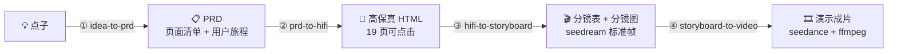

<div align="center">


# 2-hour-mvp

**一个点子进，一条 AI 产品演示片出。**

PRD · 可点击高保真 · 分镜图 · 演示视频 —— 四个交付物，一条流水线，两小时。

[](https://skills.sh/losdwind/2-hour-mvp)
[](https://github.com/losdwind/2-hour-mvp/releases)
[](LICENSE)
[](https://agentskills.io)

```bash
npx skills add losdwind/2-hour-mvp
```

</div>

---

<div align="center">

### 你说一句话

> _"在猫咖里背单词的 App，背词就是营业，猫是学习搭子，有断签回归安抚"_

### 它还你一条片子


<sub>「猫咖背单词」60 秒成片 · 4 倍速预览 · 20 镜覆盖全部 19 个页面 · 本页所有产物均出自这一个案例</sub>

</div>

---

## 它是怎么做到的



统一入口技能 `product-video` 自动判断你手里的东西处于哪一步，从那一步接着跑。每个阶段独立成技能、独立交付，拿着现成 PRD 或交互稿可以从中间任意一步进场。

| 技能 | 作用 | 交付物 |
| ------------------- | ---------------------- | -------------- |
| **product-video**   | 统一入口，判断起点、串联四阶段、设检查点   | 全链路            |
| **idea-to-prd**     | 问答把点子收敛成 PRD           | PRD markdown   |
| **prd-to-hifi**     | 按 PRD 页面清单生成可点击交互稿     | 单文件 HTML       |
| **hifi-to-storyboard**  | 截图、规划分镜、seedream 生成分镜图 | 截图 + 分镜表 + 分镜图 |
| **storyboard-to-video** | seedance 逐镜生成、加速拼接     | 成片 mp4 + 质检图   |

## 四个交付物，同一个案例

### ① PRD — 页面清单直接喂给下一阶段

```markdown
| 页面 id      | 页面名     | 业务分组 | 核心元素                               | 进入方式      |
| home        | 猫咖首页   | 主界面   | 场景背景、今日营业进度、开门营业大按钮   | 引导完成后默认 |
| quiz-wrong  | 答错安抚   | 每日学习 | 弹层"没关系再看一眼"、词义回看、继续按钮 | 答错任意题目   |
| streak-back | 断签回归态 | 主界面   | 安抚卡"昨天休息了一天"、重新开门按钮     | 断签后次日启动 |
```

页面清单宁全勿缺——答错安抚、断签回归这类状态页，恰恰是演示视频里最打动人的镜头。

### ② 可点击高保真 — 单文件 HTML，真文案真状态


<sub>19 页全览：引导 5 页、主界面 3 页、每日学习 5 页、结算 2 页、周边 4 页。奶油粉彩风由问答选定，页面间按真实业务流跳转，file:// 打开即可点</sub>

### ③ 分镜图 — 每页一张统一风格标准帧


<sub>seedream 把每页截图放进统一环境（soft 3D 猫咖），UI 文字像素级可读</sub>

### ④ 成片 — 3 秒一镜，按业务逻辑走完全部页面


<sub>20 镜逐镜抽帧：空镜入场 → 引导五连 → 开门营业 → 学词答题 → 结算礼物 → 周边页面 → 断签回归 → 品牌帧收尾</sub>

## 成片质感靠三条硬规则

**剪辑点零跳变。** 每页只做一张标准帧，镜 k 的尾帧就是镜 k+1 的首帧——剪辑点两侧是同一张图，不需要任何转场遮羞。

**机身静止，只切屏幕。** 运动 prompt 内置硬约束，设备全程不翻转不漂移，观众的注意力始终在产品交互上；仅入场与收尾两镜允许设计性运动。

**先试跑，后批量。** 生成前报即梦积分预估，试跑 2-3 镜确认节奏后才批量提交；下载自动校验截断、断点可免费续跑。参考成本：上面 60s 成片约 1500 积分，12s 短片约 500。

## 安装

**Claude Code / Codex / Cursor / OpenCode 等 70+ agent**

```bash
npx skills add losdwind/2-hour-mvp
```

**Claude Cowork** — 下载 [Releases](https://github.com/losdwind/2-hour-mvp/releases) 里的 `2-hour-mvp.plugin`，拖进对话点安装。

<details>
<summary><b>依赖</b>（点开）</summary>

- 即梦 dreamina CLI，阶段 ③④ 使用：`curl -s https://jimeng.jianying.com/cli | bash`，首次 OAuth 登录，生成消耗即梦积分
- ffmpeg、Python3 + PIL，校验与后期
- headless 浏览器任一（puppeteer / playwright / Chrome），仅阶段 ③ 截图用

</details>

<details>
<summary><b>交付物衔接约定</b>（点开）</summary>

页面 id 在 PRD 页面清单里定义，交互稿 DOM 用 `#s-<页面id>`，截图与分镜帧文件名沿用同一 id。四个阶段无缝续跑，也可从任意中间产物进场。

</details>

---

<div align="center">

用一句话换一条产品片 · 觉得有用点个 ⭐

MIT © [losdwind](https://github.com/losdwind)

</div>
