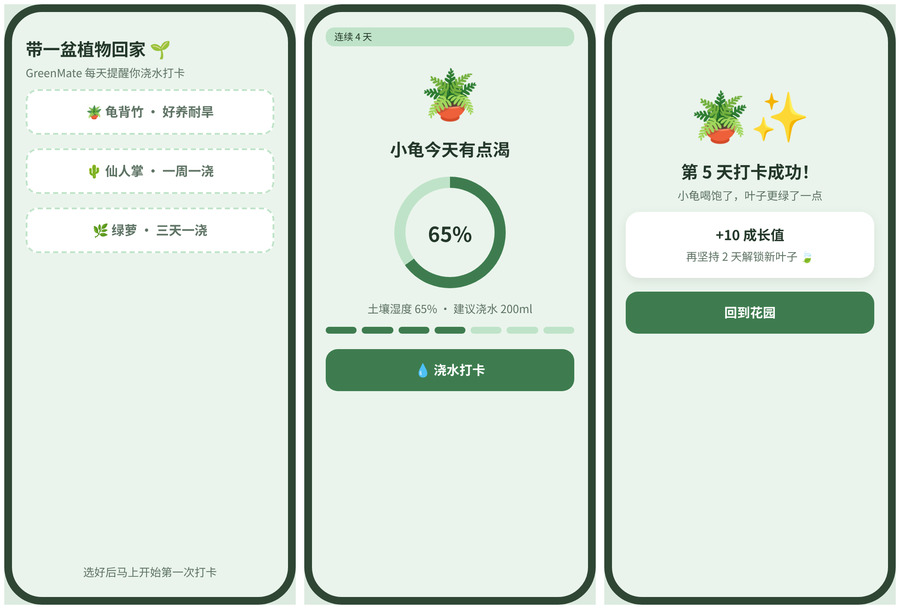
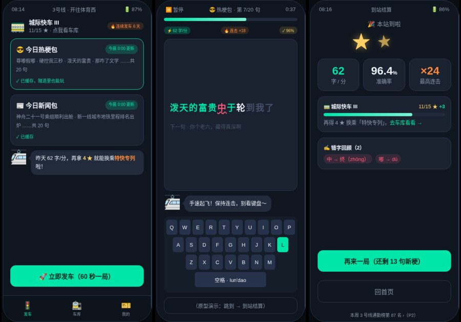
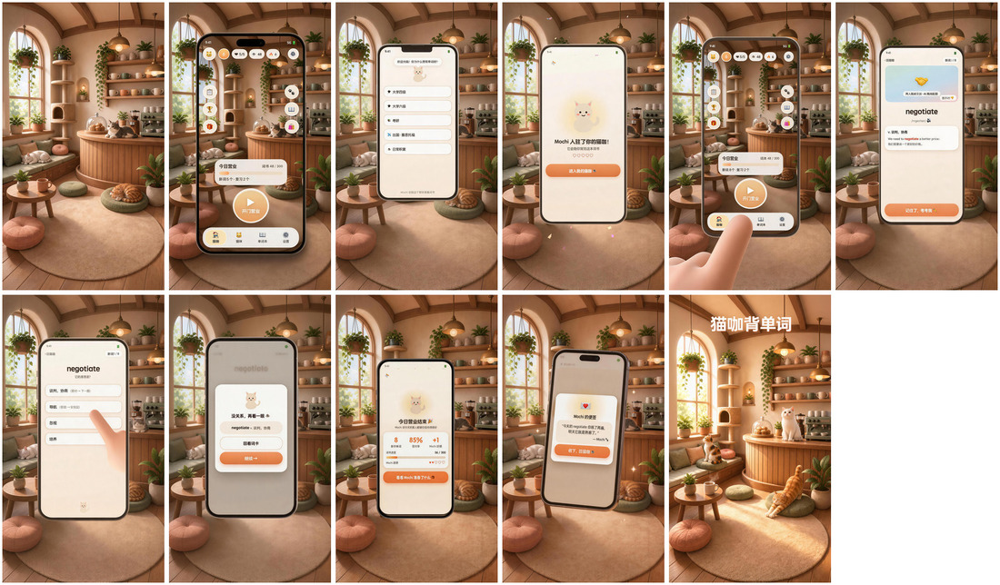
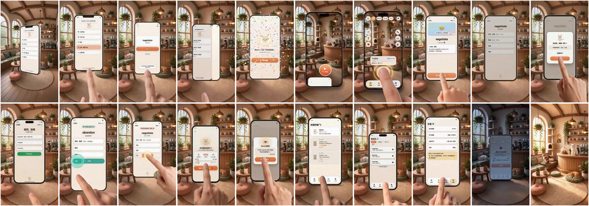

# 2-hour-mvp

[](https://skills.sh/losdwind/2-hour-mvp)

2 小时从一个点子做出可演示的 MVP。四个交付物一条流水线：**PRD → 可点击高保真 → 分镜图 → AI 演示视频**，视频生成基于即梦 seedream / seedance。

<table>
<tr>
<td width="62%" valign="top">

**输入** · 一句话点子，或一份多页高保真交互稿

> "地铁通勤时用碎片时间练打字的 App，内容是热梗和新闻标题，有段位系统"

流水线自动完成 PRD 问答收敛、界面生成、逐页截图、分镜规划、AI 帧生成与视频合成。



</td>
<td width="38%" valign="top">

**输出** · AI 演示视频成片


<sub>GreenMate 浇花打卡 · 3 页交互稿 → 12s 成片，全流程由本技能自动完成</sub>

</td>
</tr>
</table>

## 工作流

```
 点子 ──▶ ① idea-to-prd ──▶ ② prd-to-hifi ──▶ ③ hifi-to-storyboard ──▶ ④ storyboard-to-video
           PRD 文档          可点击 HTML         分镜表 + 分镜图            视频成片 mp4
```

统一入口技能 `product-video` 自动判断你手里的东西处于哪一步，从那一步接着跑；每个阶段技能也可以单独使用。

| 技能 | 作用 | 交付物 |
| ------------------- | ---------------------- | -------------- |
| product-video       | 统一入口，判断起点、串联四阶段、设检查点   | 全链路            |
| idea-to-prd         | 问答把点子收敛成 PRD           | PRD markdown   |
| prd-to-hifi         | 按 PRD 页面清单生成可点击交互稿     | 单文件 HTML       |
| hifi-to-storyboard  | 截图、规划分镜、seedream 生成分镜图 | 截图 + 分镜表 + 分镜图 |
| storyboard-to-video | seedance 逐镜生成、加速拼接     | 成片 mp4 + 质检图   |

## 各阶段真实产物

### ① PRD · 页面清单直接喂给下一阶段

```markdown
| 页面 id   | 页面名   | 业务分组 | 核心元素                                   | 进入方式        |
| practice | 打字练习 | 核心练习 | 60秒倒计时、当前句逐字高亮、实时字/分与连击 | 首页点"立即发车" |
| comeback | 回归补签 | 状态页   | 断签天数、吉祥物安慰文案、补签卡领取按钮     | 断签≥2天后启动   |
```

<sub>「指尖快车」打字 App，从一句话点子问答生成，8 页清单含空态/断网/回归等状态页</sub>

### ② 可点击高保真 · 单文件 HTML，真文案真状态



<sub>暗色霓虹地铁风由问答选定；页面间用真实业务流跳转，file:// 直接打开可点</sub>

### ③ 分镜图 · 每页一张统一风格标准帧



<sub>「猫咖背单词」项目：seedream 把每页截图放进统一环境（soft 3D 猫咖），UI 文字保持像素级可读。镜 k 尾帧 = 镜 k+1 首帧，剪辑点零跳变</sub>

### ④ 成片 · 3 秒一镜按业务逻辑走完全部页面



<sub>60 秒 20 镜覆盖全部 19 个页面，手机机身全程静止只切屏幕内容，结尾品牌帧收束</sub>

## 安装

任意支持 Agent Skills 规范的 agent（Claude Code、Codex、Cursor、OpenCode 等 70+）：

```bash
npx skills add losdwind/2-hour-mvp
```

Claude Cowork 用户：下载 [Releases](https://github.com/losdwind/2-hour-mvp/releases) 里的 `2-hour-mvp.plugin` 直接安装。

## 用法

对 agent 说"把这个 idea 做成演示视频"走全流程；或把 PRD / 交互稿 / 分镜表直接丢给对应阶段技能。每进入花钱阶段前会先报即梦积分预估并等你确认（参考成本：12s 成片约 520 积分，60s 约 1500）。

## 依赖

- 即梦 dreamina CLI（阶段 ③④ 使用，`curl -s https://jimeng.jianying.com/cli | bash`，首次 OAuth 登录，生成消耗即梦积分）
- ffmpeg、Python3 + PIL（校验与后期）
- headless 浏览器任一（puppeteer / playwright / Chrome），仅阶段 ③ 截图用

## 交付物衔接约定

页面 id 在 PRD 页面清单里定义，交互稿 DOM 用 `#s-<页面id>`，截图与分镜帧文件名沿用同一 id，四个阶段可无缝续跑，也可从任意中间产物进场。

## License

MIT
